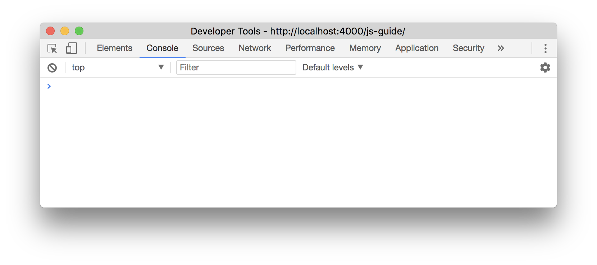

**These notes support the in-class programming lecture on Oct. 30th.**
JavaScript is a popular programming language used initially for providing
interactivity to webpages, but now also is used for programming server
applications (see [NodeJS][node] or [Meteor][meteor]). As web standards shift,
popular JavaScript frameworks come and go quite [often][web]. We will focus
more on the basics of the language and common application patterns of get you
started quickly than detailing all of the insides of a specific framework.

To get started: start up a JS console (in Chrome you can use Opt-Cmd-J).

Running hello world:

    console.log('hello world')

Comments follow a C-like standard:

    // I am a comment

    /*
    I am also a comment which spans multiple lines
    */

There are multiple types of console logging methods (`log`, `warn`, `error`),
but log is standard. To save data, use `var`:

    var str = 'cs'
    var num = 160

By default, JS does not have a strict typing system (though there is
[TypeScript][ts]), but it usually handles common data combination cases well.
Fun counterexamples [exist][wat]. What do you think will be the result of these
lines?

    var sn = str + num
    var ns = num + str
    console.log(sn, ns)

We can also check the type of data using `typeof`.

    var st = typeof('cs') // string
    var nt = typeof(160) // number
    var ft = typeof(160.00) // float

    // What will result?
    console.log(st == nt)
    console.log(nt == ft)
    console.log(ft == st)

The last two cases are the same, since JS uses just one representation for
numeric data (`number`). Further, JavaScript has two types of equality
comparisons of varying rigidity (`==` vs. `===`), which differentiate from two
values roughly being equal and precisely equal. What do you predict will be
generated from the code below?

    console.log( // can take multiple arguments
        1 == 1,
        1 == '1',
        1 == '2',
        1 === '1'
    )

Control flow is delegated similar to that of C or Python, with standard ifs,
case statements. There are addition patterns like asynchronous functions,
callbacks, and event handlers which we will touch on later.

    var wearJacket
    var temp = 75

    if (temp < 50) {
        wearJacket = True
    } else {
        wearJacket = False
    }

[Arrays][marr] and [Objects][mobj] are used frequently to organize data. There
are multiple ways to instantiate these data types:

    // Array literal
    var arr_1 = [1, 2, "a", "b"]

    // Push method
    var arr_2 = []
    arr_2.push(1, 2, "a", "b")

    // What will the output be?
    console.log(arr_1, arr_2)
    console.log(arr_1 == arr_2)

The last line actually returns false, as the equality operator cannot be used
to compare Arrays or Objects - their data would have to be compared
element-wise for equality checks. There are also external library functions
which facilitate this process, like Underscore's isEqual.

Objects have key-value pairs, and align closely to the JSON data format
(JavaScript Object Notation) that many API endpoints use to structure their
responses. Note that it is possible to build complex structures out of
combinations of these structures (Array of Objects, Object with Array fields).

    // Object literal
    var obj_1 = { name: 'Alice', class: 'CS160' }

    // Assignment
    var obj_2 = {}
    obj_2.name = 'Robert'
    obj_2.class = 'CS160'

    // What will the output be?
    console.log(arr_1, arr_2)
    console.log(arr_1 == arr_2)

### Functions

Defining a function can be done like this:

    function add(x, y) { // one way to define functions
        return x + y
    }

    var sub = function (x, y) { // another perfectly fine way to do this!
        return x - y
    }

    console.log(add(2, 1))
    console.log(sub(2, 1))

JavaScript relies heavily on functions. Functions are first-class data types,
meaning that they can be passed into other functions. This is seen in the
asynchronous data callback pattern.

Data iteration and manipulation is often done in a functional pattern, as
opposed to the imperative style of using for loops. This can improve
the readability and flexibility of your code. What do you think `arr_2` will
hold?

    // Function to square input
    function square(x) { return x * x }

    // Function map example
    var arr_1 = [2, 3, 5, 7, 11]
    var arr_2 = arr_1.map(square)

This is also a handy way to select a subset of attributes of a list of verbose
objects.

    // List of Twitter Responses is in twResult.
    var filterTw = twResult.map(o => {
        user: o.screen_name,
        link: o.user_profile,
    }) // arrow function is ES2016 syntax

`filterTw` will have a subset of the data which can make debugging much easier.
You may have use this pattern while working on assignment 3, and it is in the
[staff solution][soln] for assignment 3. Similar to modifying data, we can
[filter][mfil] and [reduce][mred] data in a functional fashion.

    var arr = [2, 3, 5, 7, 11]

    // Reducing with an anonymous (unnamed) fn
    var sum = arr.reduce(function(sum, value) {
        return sum + value
    }, 0) // base case

    // Filtering
    var filtered = arr.filter(function(n) {
        return n > 5
    })

    // Finding
    var found = arr.find(function(n) {
        return n > 15
    })

    // What will these variables hold?
    console.log(sum)
    console.log(filtered)
    console.log(found)

Finally, since background computation and DOM computations share a single
thread, it is a bad idea to have blocking parts of your code. One concrete
example: using `while` loops to wait for an event to occur will often freeze
the tab. One pattern that is used to address this is event-driven functions:
event handlers.

**HTML**:

    <button id="myBtn"> PRESS </button>

**JavaScript**:

    function myClick() { console.log('clicked') }
    var btn = document.getElementById("myBtn")
    btn.addEventListener("click", myClick)

[Here][dom] is the list of HTML DOM (document-object-model) events.

A good way to think of this is giving advance instructions on how to handle the
result of your request. Imagine if you ordered a burrito, and then you just
couldn't move or think until you are handed the finished burrito. That is what
you would be doing to your code if you wait with `while` loops. Don't do this!

We also saw this callback pattern with Meteor client/server function calls:

    Meteor.call("query", "users/show", { user_id: tId }, function(err, result) {
    if (err) {
        console.warn(err)

    } else { // get the current user profile
        pushUser(result)

        // get full friends objects for the current user, until we hit the API limit
        Meteor.call("query", "friends/list", { user_id: tId, count: 15   }, getUserFriends)
    }

I suggest checking out the reference materials to further familiarize yourself
with JavaScript since it will be leveraged for building your final projects. On
Wednesday, we will work through building an example Chat app in Meteor.

### References

- [Meteor Chat App][mchat]
- [Codecademy JS Track][codecad]
- [Mozilla JS reference][mozilla]
- [learn-you-node tutorial][learnyounode]
- [AirBnb style guide][ajs]
- [W3 NodeJS guide][w3node]

If you have questions, would like to add material, or see errors in this guide,
please [email](/#course-staff) Jeremy Warner. Thanks!

The source for this page is open and on [GitHub][gh].

[ajs]:https://github.com/airbnb/javascript
[node]:https://nodejs.org/en/
[soln]:https://github.com/cs160-berkeley/twitter-graph-solution/blob/master/client/main.js#L36-L46
[meteor]:https://www.meteor.com/
[mchat]:https://themeteorchef.com/tutorials/building-a-chat-application
[marr]:https://developer.mozilla.org/en-US/docs/Web/JavaScript/Reference/Global_Objects/Array
[mobj]:https://developer.mozilla.org/en-US/docs/Web/JavaScript/Reference/Global_Objects/Object
[mfil]:https://developer.mozilla.org/en-US/docs/Web/JavaScript/Reference/Global_Objects/Array/Filter
[mred]:https://developer.mozilla.org/en-US/docs/Web/JavaScript/Reference/Global_Objects/Array/Reduce
[codecad]:https://www.codecademy.com/en/tracks/javascript
[wat]:https://www.destroyallsoftware.com/talks/wat
[mozilla]:https://developer.mozilla.org/en-US/docs/Learn/Getting_started_with_the_web/JavaScript_basics
[gh]:https://github.com/cs160-berkeley/website/blob/master/js-guide.md
[web]:https://hackernoon.com/how-it-feels-to-learn-javascript-in-2016-d3a717dd577f
[learnyounode]:https://github.com/workshopper/learnyounode
[dom]:https://www.w3schools.com/jsref/dom_obj_event.asp
[w3node]:https://www.w3schools.com/nodejs/nodejs_get_started.asp
[ts]:https://www.typescriptlang.org/

